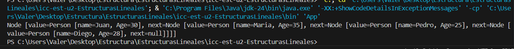
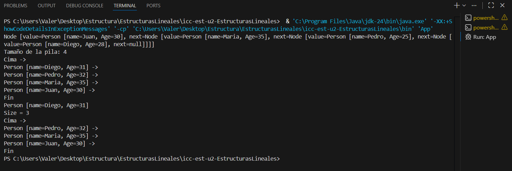
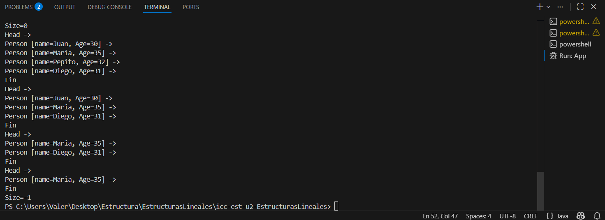

# Práctica de Búsqueda y Ordenamiento de Objetos

## Información General
- **Título:** Tiempos
- **Asignatura:** Estructura de Datos
- **Carrera:** Computación
- **Estudiante:** Kelly Valeria Guaman Leon
- **Fecha:** 08/12/2025
- **Profesor:** Ing. Pablo Torres

## Estructuras Lineales

## Salida del codigo en consola

## Lista Enlazada
